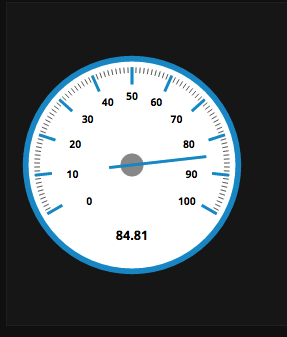
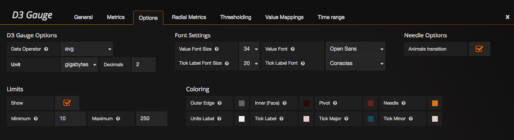

# Grafana Gauge Panel

This panel plugin provides a [D3-based](http://www.d3js.org) gauge panel for [Grafana](http://www.grafana.org) 3.x

#### Screenshots

##### Example gauges

##### Options

With Limits

##### Limits Shown

##### Radial Metrics

##### Thresholding

-------

## Features

* Data operator same as SingleStat panel (avg, sum, current, etc)
* Unit formats same as SingleStat

* Customizable Font size and type for value displayed and ticks
* Animated needle transition (elastic or quadin)
* Adjustable Limits
* All possible color options for gauge components

* Customizable gauge component sizes (needle length, width, tick length, etc)

* Thresholding colors displayed on gauge
* Threshold can modify displayed value and background

## External Dependencies

* Grafana 3.x

## Build Dependencies

* npm
* bower
* grunt

#### Acknowledgements

This panel is based on the "SingleStat" panel by Grafana, along with large portions of these excellent D3 examples:
* https://oliverbinns.com/articles/D3js-gauge/
* http://bl.ocks.org/tomerd/1499279

#### Changelog

##### v0.0.1
- Initial commit
